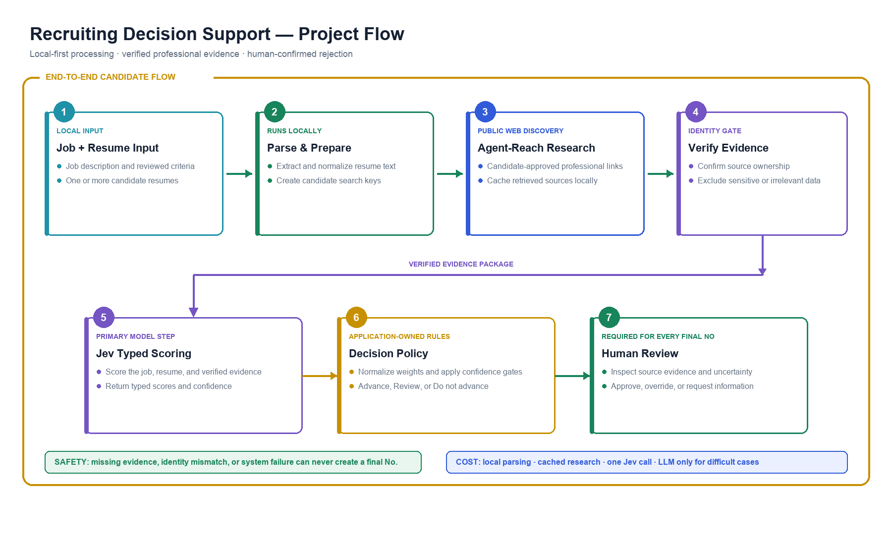
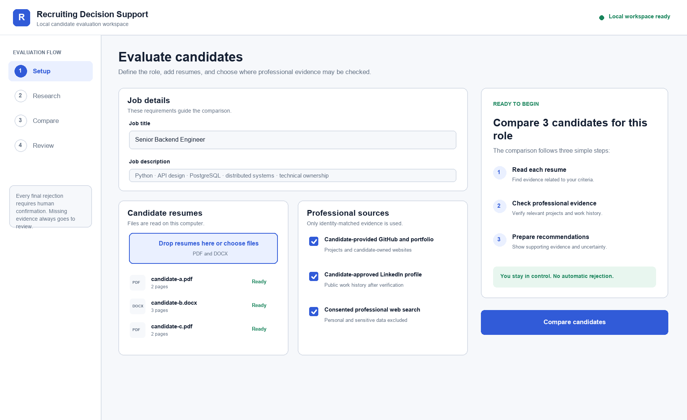
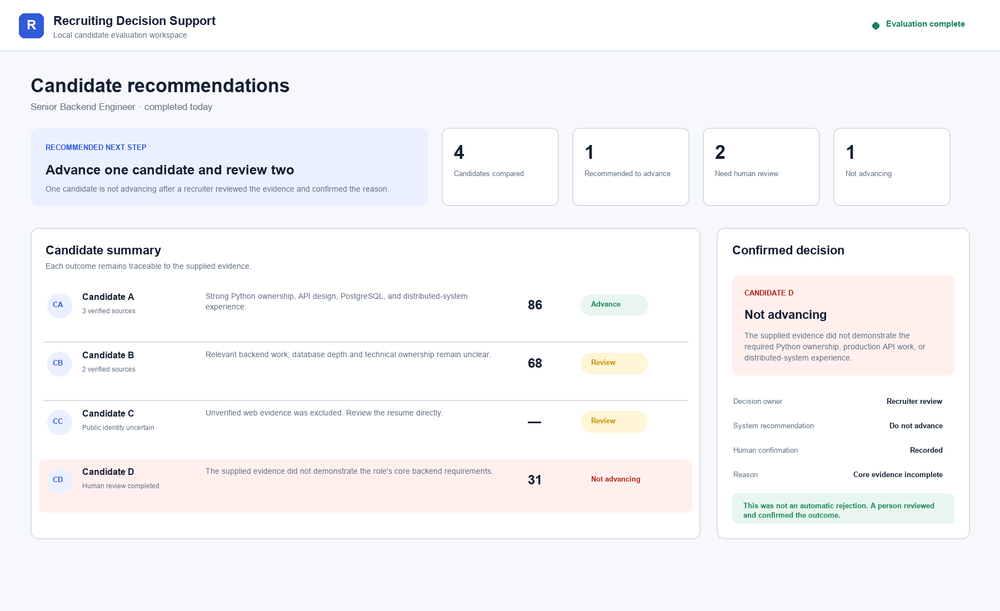

# Beyond Resume Keywords

## Designing an Evidence-First Recruiting Assistant

A local-first recruiting decision-support concept that combines consent-based
professional research, typed scoring, deterministic policy, and meaningful
human review.

> **Status:** Concept architecture and illustrative prototype. This is not a
> validated or production-ready hiring system.

## Product thesis

Help reviewers find job-relevant evidence while making false candidate
rejection harder.

The proposed system:

- Accepts a job description and one or more resumes.
- Parses candidate documents locally.
- Uses [Agent-Reach](https://github.com/Panniantong/Agent-Reach) as an
  experimental adapter for candidate-provided or explicitly consented
  professional sources.
- Verifies source identity and provenance before scoring.
- Uses [TypeSafe Jev](https://www.jevtypesafeai.com/) for narrow, typed
  judgments.
- Keeps thresholds and decision routing in deterministic application code.
- Requires human confirmation for every final decision not to advance.

## Architecture

The internal result has three states:

- **Advance** — strong, complete evidence with confidence gates passed.
- **Review** — missing, conflicting, borderline, or uncertain evidence.
- **Do not advance** — evidence below the configured threshold, still requiring
  human confirmation.

Missing evidence, identity mismatch, parsing failures, provider errors, and
budget limits can never directly produce a final rejection.

## Prototype

### Evaluation setup

The setup experience explains the workflow in plain language: read each resume,
check approved professional evidence, and prepare recommendations with
supporting evidence.

### Candidate summary

The result screen supports advance, review, identity-uncertain, and
human-confirmed not-advancing cases. Candidate names, evidence, scores, and
outcomes shown here are fictional and exist only to communicate the proposed
interaction design.

## Safety boundaries

- Professional research is limited to candidate-provided links or source
  categories covered by explicit notice and consent.
- A discovered page is excluded unless its identity and provenance are
  verified.
- Protected, sensitive, personal, and popularity-based information is not
  scored.
- A missing public profile is not negative evidence.
- The system does not make autonomous employment decisions.

## Current scope

This repository intentionally contains only the public concept overview,
architecture, and prototype images. No candidate data, credentials, model keys,
or production implementation is included.

## Attribution

This concept references
[Agent-Reach](https://github.com/Panniantong/Agent-Reach), an MIT-licensed
open-source capability layer maintained by Panniantong. Agent-Reach is cited as
an experimental integration dependency; it is not bundled or redistributed in
this repository.

## Author

**Sneha Srikanth**

- [LinkedIn](https://www.linkedin.com/in/snehasrik21)
- [GitHub](https://github.com/snehasrikanth)

## Rights

Copyright © 2026 Sneha Srikanth. All rights reserved.

No license is granted to copy, modify, distribute, sublicense, or create
derivative works from the written content, architecture, or prototype images in
this repository without prior written permission from the copyright owner.

This repository presents a product concept and engineering safeguards, not
legal advice.
